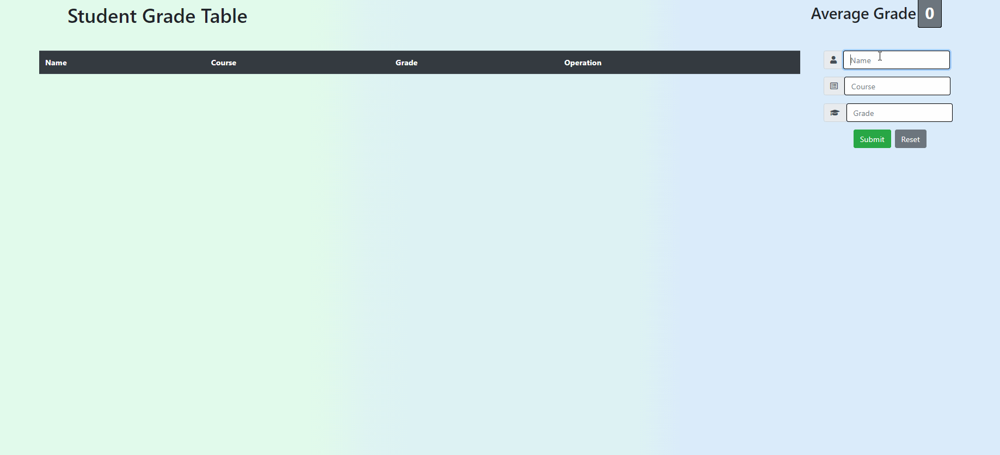

# Student Grade Table

> - Maintained by: `James Dinh - jdinh8124`


## Summary
- Full stack mobile-responsive Content Management System that communicates via Fetch allowing users to Create, Read, Update, and Delete (CRUD) student information through PostgreSQL, Node, and React. The project is deployed using AWS, ubuntu and nginx

## Live Demo 
Link: https://student-grade-table.jamestdinh.com/

## Languages & Technologies Used
- React.js
- JavaScript (ES5 & ES6)
- NodeJS
- PostgreSQL
- Bootstrap
- HTML5
- CSS3
- AWS EC2
- Ubuntu
- Nginx

## Features
- Users can add student grades
- Users can delete grades
- Users can update student information
- User can create an account
- User can sign into account
- User can try out application in guest mode

## Planned Additions
- Different themes
- Multiple Classes

## Takeaways
- The power of react and passing props making the UI more efficent
- I believe that React makes writing our node backend a lot easier
- Bootstrap makes css and media queries a lot easier 
- The bcrypt package makes handling passwords a lot easier 

## Getting Started

1. Clone this repository from your github to your local computer
```

git clone https://github.com/jdinh8124/Student-Grade-Table

```
2. Install all dependencies in `package.json` with NPM.
```

npm install

```
3. Run npm dev
``` 

npm run dev

```
4. Open your browser to localhost:3000
```  

https://localhost:3000 

```
5. Enjoy and make sure this is just an example site!

## Live Demo


