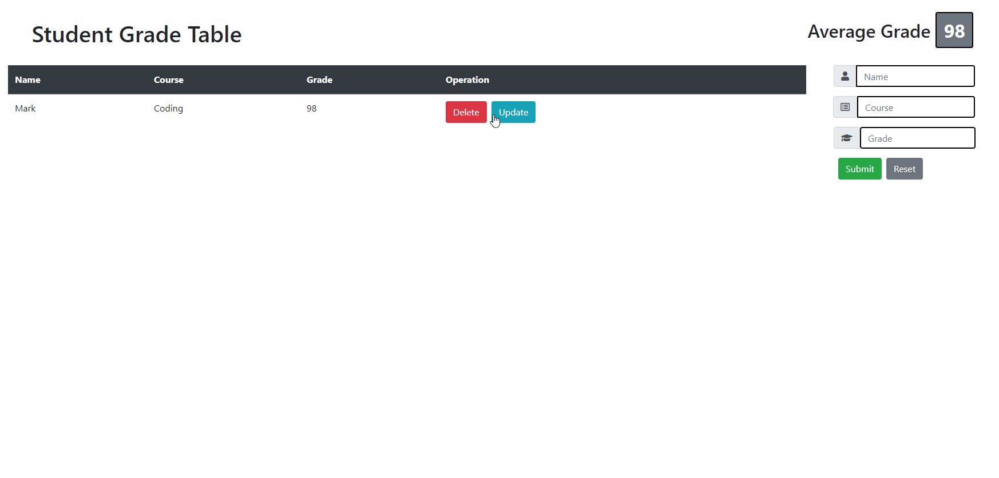

# sgt-react

> - Maintained by: `James Dinh - jdinh8124`

## Live
[Link To Live Site](https://student-grade-table.jamestdinh.com/)


## Summary
- The Student Grade Table: Written in React, server built in node.js + express, and database written on postgreSQL.

## Languages Used
- React.js
- JavaScript (ES5 & ES6)
- NodeJS
- PostgreSQL
- HTML5
- CSS3

## Features
- Users can add student grades
- Users can delete grades
- Users can update student information

## Planned Additions
- Different themes
- Multiple Classes
- Teacher Login screen with a button for guest
- bcrypt addition you sign in

## Takeaways
- The power of react and passing props making the UI more efficent
- I believe that React makes writing our node backend a lot easier
- Bootstrap makes css and media queries a lot easier 

## Getting Started

1. Clone this repository from your github to your local computer
```

git clone https://github.com/jdinh8124/Student-Grade-Table

```
2. Install all dependencies in `package.json` with NPM.
```

npm install

```
3. Run npm dev
``` 

npm run dev

```
4. Open your browser to localhost:3000
```  

https://localhost:3000 

```
5. Enjoy and make sure this is just an example site!

## Live Demo

